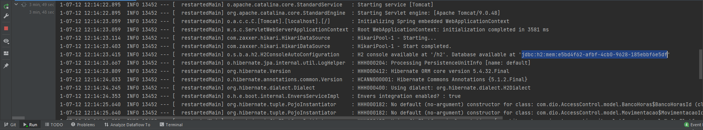
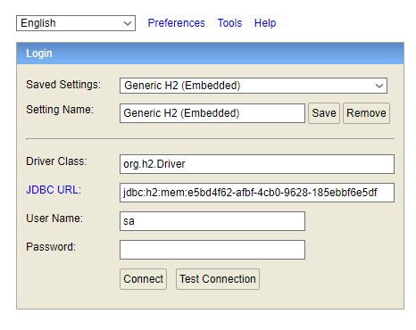
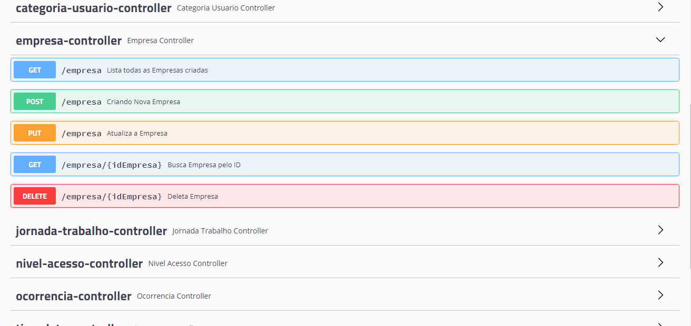

#Criando API Controle de Ponto e Acesso

Esta API foi criada seguindo os passos das vídeo-aulas dispoíveis no BootCamp da Digital Innovation One em Parceria com o Banco Santander.

------------

Recursos
	- Para a criação desta API foi utilizado o Java, SpingBoot, Hibernate, Lombok e documentada com Swagger.

------------

	
 Rodando o Projeto
	Todas as dependências necessárias estão no arquivo build.gradle.
	 Na Pasta resources há o arquivo application.properties, onde foi declarado que a API irá rodar na porta 8081.
	Neste mesmo arquivo foi declarado as conexões do MySQL onde se encontra comentado caso queira realiza-lá.
	Quando o projeto for iniciado irá gerar a URL de acesso ao banco de dados:

	

------------

##Acesso ao bando de dados
Após compiar a URL, acesse no seu navegador: localhost:8081/h2 e cole a URL no campo JDBC URL 

##Documentação Swagger

Para ter acesso documentação acesse no seu navegador http://localhost:8081/swagger-ui.html#/

